# Forecasting the Cost of Thanksgiving Dinner Using R
Jared Roy Endicott  
January 22, 2016  

 

#### Introduction

In 2015 the cost of Thanksgiving Dinner rose above $50 for the first time ever. This was also the first time in the last five years that I had not attempted to predict what that price would be. Beginning in 2010 I wrote and posted a blog article each November in which I forecast the cost of the year after's Thanksgiving Dinner. However, I stopped writing my blog in 2014. Having skipped a year, it is my purpose here to revive this holiday tradition and attempt to forecast what the cost of Thanksgiving Dinner will be in 2016. 

Each year the articles focused on a different topic related to Thanksgiving Dinner costs, discussing the economics of food prices, inflation, globalization, monetary policy, the impacts of weather and drought, forecasting methods and practices, and even my experiences visiting Istanbul, Turkey for an invaluable <a href="http://cpdftraining.org/" target="_blank">CPDF: Certified Professional Demand Forecaster</a> workshop conducted by renowned expert and mentor on the subject Hans Levenbach. This year I am sure to cover some of this familiar ground again, but the twist is that I will be applying a new skill to the analysis and forecasting of Thanksgiving Dinner. Over the last year I have been learning how to program using R for the <a href="https://www.coursera.org/specializations/jhu-data-science" target="_blank">Data Science Specialization through John Hopkins University on Coursera</a>. For those who don't know, R is an open source programming language that is especially useful for handling data analysis. This whole article, the text, data collection, charts, forecast models, html document, and all the rest, has been produced using R Studio. 

The American Farm Bureau Federation (AFBF) has been measuring the cost of Thanksgiving Dinner through an informal price survey since 1986. Similar to the calculation of the consumer price index (CPI), although much smaller and simpler, the AFBF survey tracks the prices of goods in a market basket of traditional Thanksgiving Dinner items for feeding a gathering of 10 people. This market basket includes a 16-pount turkey, 1 gallon of milk, 3 lbs. or sweet potatoes, 30 oz. of pumpkin pie mix, 14 oz. of cube stuffing, 2 pie shells, 12 oz. of fresh cranberries, 12 rolls, ½ pint of whipping cream, 1 lb. of green peas, and a 1-pound relish tray of celery and carrots. Also miscellaneous items such as coffee, plus ingredients to prepare the meal, such as butter, evaporated milk, onions, eggs, sugar and flour ("Thanksgiving Dinner..."). The AFBF survey will be the basis of my analysis and forecast.

Let us first consider just the data on Thanksgiving Dinner prices. When the tracking of Thanksgiving Dinner costs began in 1986 that cost was only $28.74. In 2015 the cost has risen to $50.11 for a total change of 74.36%. This averages out to 2.48% per year. In Fig. 1 we view how the price changes between 1986 and 2015. As we can see the price has ben increasing generally, although after showing a sharp increase between 2010 and 2011 the price has flattened out and remained steady until 2015.

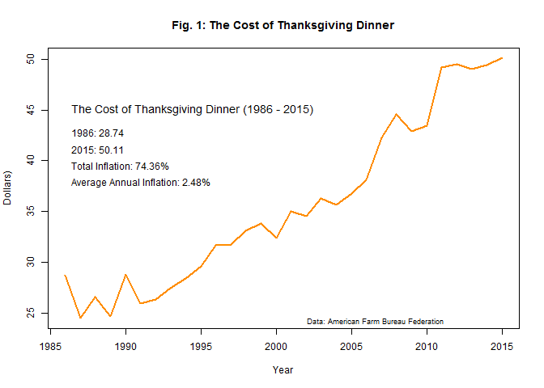 

#### What Drives Food Prices?

Patrick Westhoff's book, *The Economics of Food*, is an excellent introduction into the factors that drive food prices. As with other economic dimensions food prices are determined most generally by supply and demand. However, underlying this oversimplification is a complex web of interactions and feedback loops, with no simple formulation that can provide us with an easy way to predict exactly where prices will head in the future. Nevertheless, Westhoff does provide eight rules of thumb that can be used as a guide for understanding the most salient factors in food price movements. They are as follows:

* Food prices increase when biofuel production increases (Westhoff 10).
                
* Food prices move in the same direction as oil prices (35).
                
* Food prices can be driven up or down by relevant government policies (57).
                
* Food prices rise when adverse weather reduces yields (81).
                
* Food prices rise and fall with consumer incomes around the globe (97).
                
* Food prices measured in dollars rise when the value of the dollar weakens against other currencies (115).
                
* Market speculation can tenporarily move prices in any direction, but fundamentals will be reasserted in the end (129).
                
* There will always be unpredictable factors that confound prediction of food prices, such as crop diseases, animal viruses, war, and even diet fads (143).
                
Besides the factors that specifically impact food prices, there is the question of what underlies price changes for all consumer items. Inevitably, these details are even more complex and difficult to unwind than those for food, so it's easier to talk about some higher level concepts. When prices increase in an inflationary environment, the cause--at least the proximate one--can be categorized as demand pull or cost push. When the price level of all items increases it could be because aggregate demand has outpaced the rise of aggregate supply, so demand is pulling the price level higher. Cost push inflation happens when the factors of production, such as raw materials and labor, trend higher and this increase pushes up the prices of goods and services that require these inputs. 

Demand pull and cost push are certainly ideas that help to explain short run price increases, but the sustained increase in the general price level over time requires additional explanation. It was the legendary economist Milton Friedman who summed up the root of the issue in his famous quip, "Inflation is always and everywhere a monetary phenomenon" (Mishkin 613). This is a reference to the fact that inflation, the persistent long run increase in the overall price level, is caused by a consistent increase in the money supply over time. The rise in money stocks has been at a higher pace than the supply of the goods and services that are purchased with this money, and this means that over the years the individual value of each monetary unit has declined relative to goods and services they buy, pushing up those prices. This has not necessarily been the case for indvidual goods and services, but is true of the aggregate price level. 

#### What Drives Thanksgiving Dinner Costs?

The traditional Thanksgiving Dinner as measured by the AFBF includes several different foods that might be at your table, but the the 16-pound turkey is by far the most costly. With an average price of $23.04 in 2015, the turkey accounts for about 46% of the total cost. This suggests that changes in the price of turkey will have the largest effect on the change in total cost, and the 1.42% increase in Thanksgiving Dinner prices from 2014 to 2015 is overwhelmingly due to the year over year increase in the price of the holiday bird. The cost of the turkey increased by $1.35 or 6.42%. This represents almost 200% of the total change in the cost of dinner, which was offset by declines in other food items for a total increase of $0.70 ("Thanksgiving Dinner..."). The significance of this staple to Thanksgiving Dinner calls for a deeper dive into the cost of turkeys.

The cost for turkeys is going to be driven by many of the same factors as food prices overall, with supply and demand being the general determinants of the price. In order to show off their excellent Power BI tools, Microsoft has a cool demo animation that illustrates the areas of the US that produce the most turkeys as well as the areas that consume the most turkeys. Check out Microsoft's presentation at "<a href="http://blogs.msdn.com/b/powerbi/archive/2013/11/27/where-do-turkeys-come-from-let-s-find-out-using-power-bi.aspx" target="_blank">Where Do Turkeys Come From? Let's Find Out Using Power BI</a>." The US is the world's largest producer and consumer of turkey meat. Besides supply and demand, feed is the single largest expense for raising turkeys, accounting for about 60-70% of the cost (Sullivan). Turkey feed is primarily corn based, so a change in the price of corn is likely to be a significant factor in the cost for Thanksgiving Dinner. 

There are many other factors that might come into play. In past articles on the subject I have discussed some of these. In the article, "<a href="http://en.paperblog.com/thanksgiving-dinner-and-inflation-forecasts-100543/" target="_blank">Thanksgiving Dinner and Inflation Forecasts</a>." I consider the impact of globalization and the growing demand for meat from a rising middle class in China and elsewhere. I also get into the role that weather and drought play in the article, "<a href="http://en.paperblog.com/thanksgiving-dinner-inflation-droughts-and-the-dust-bowl-357092/" target="_blank">Thanksgiving Dinner Inflation, Droughts, and the Dust Bowl</a>." Besides these considerations, a new factor has emerged recently, and that is the problem of bird flu. The US experienced the worst avian influenza outbreak in 2015, which forced the culling of 8 million turkeys, causing a five year low in production (Mulvany). Bird flu did not have a large impact on the price of Thanksgiving Dinner for 2015, and while it's difficult to project the impact on next year since we don't know if there will be any additional outbreaks between now and then, this has to be considered. In the next section I will explore various factors that might aid in the prediction of Thanksgiving Dinner costs in the years to come.

#### Exploratory Analysis

A helpful visualizaiton for a single data vector is a histogram. In Fig. 2 I examine a histogram of the annual year over year changes in price between 1986 and 2015.The price changes appear to have a roughly normal distribution. This pattern of central tendency may be useful in making predictions about future year over year price changes for Thanksgiving Dinner. Fig. 3 is the year over year price changes in chronological order, which shows how the last four years have seen very little growth in the cost of Thanksgiving dinner. This is remarkable given that these years coincide with an unprecendented increase in the money supply by the Federal Reserve in order to fight Panic of 2008 and subsqeunt Great Recession. This monetary stimulus was done through a program dubbed quantitative easing (QE), and for years there have been hyperventilations about hyperinflation that have obviously not yet come to pass. Does this prove Milton Friedman and the quantity theory of money wrong? No, it just means that increases in the money supply are indicative of long term inflation, while inflation in the short to medium term is directed by other factors.

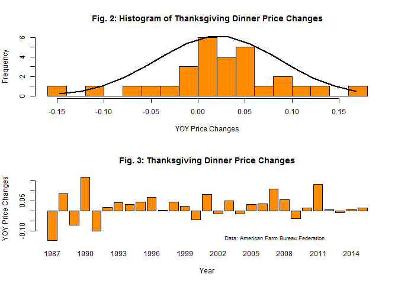 

Next we consider the year over year changes in Thanksgiving Dinner prices along side the changes in other potentionl predictor variables. Below I consider some independent variables that might be useful for predicting future changes in the cost of Thanksgiving Dinner. I am using the Federal Reserve Bank of St. Louis' FRED database as a source to gather these additional data. The variables that I am exploring include potential drivers, as well as some input factors related to Thanksgiving Dinner. These are the consumer price indices (CPI) for all items and food, the producer price indices (PPI) for turkeys, turkey feed, and corn, the prices for WTI crude oil, the dollar exchange rate versus the major currencies, and the M1 money supply. The full names of the data series I am using, along with links to the series on FRED, are provided below: 

* <a href="https://research.stlouisfed.org/fred2/series/CPIAUCNS" target="_blank">Consumer Price Index for All Urban Consumers: All Items</a>
* <a href="https://research.stlouisfed.org/fred2/series/CPIUFDNS" target="_blank">Consumer Price Index for All Urban Consumers: Food</a>
* <a href="https://research.stlouisfed.org/fred2/series/WPU022206" target="_blank">Producer Price Index by Commodity for Processed Foods and Feeds: Turkeys, Including Frozen, Whole, and Parts</a>
* <a href="https://research.stlouisfed.org/fred2/series/WPU022206" target="_blank">Producer Price Index by Industry: Other Animal Food Manufacturing: Chicken and Turkey Feed, Supplements, Concentrates, and Premixes</a>
* <a href="https://research.stlouisfed.org/fred2/series/WPU012202" target="_blank">Producer Price Index by Commodity for Farm Products: Corn</a>
* <a href="https://research.stlouisfed.org/fred2/series/MCOILWTICO" target="_blank">Crude Oil Prices: West Texas Intermediate (WTI) - Cushing, Oklahoma</a>
* <a href="https://research.stlouisfed.org/fred2/series/M1NS" target="_blank">M1 Money Stock</a>

With many potential factors to consider, searching for correlations can be challenging and time consuming. The best way to explore data like this is to visualize the data in some way. For example, say I want to compare the year over year change in all of these time series in order to locate data series that show a similar pattern. Fig. 4 is a chart of the year over year percent change for all these variables between 1986 and 2015. As you can see, this chart has a lot of data packed into it, but it is virtually impossible to read and draw any conclusions from it. There are just too many data points to consider and they all overlap each other, making this visualization messy and thoroughly unhelpful. A much better way to view the relationships between multiple variables is a matrix of scatter plots and correlations.

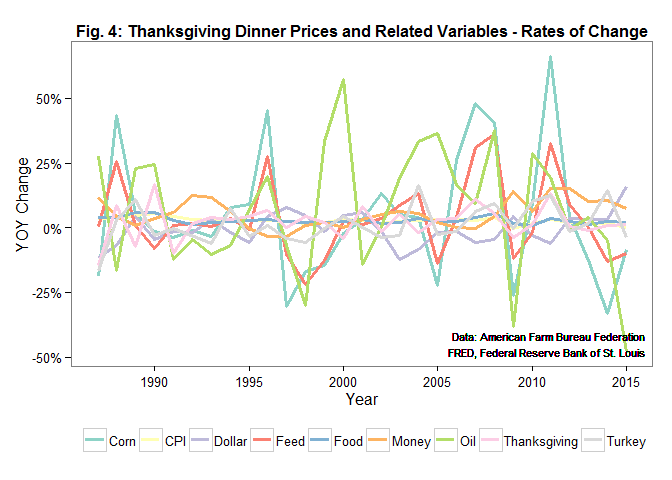 

Fig. 5 illustrates a correlation matrix for the cost of Thanksgiving Dinner versus the other independent variables. The matrix allows us view how each price variable relates to Thanksgiving Dinner using a scatter plot plus a correlation coefficient, as well as how each of these variables relate individually to each other. The cost of Thanksgiving Dinner correlates positively and strongly with all the variables over time, most significantly with food prices, all prices, the money supply, oil, and feed prices. The dollar exchange, turkeys, and corn show solid positive relationships to the holiday dinner as well, but the dollar exchange is the only inverse relationship. This means that over time the prices for all of these variables increase or decrease together, except for the dollar exchange rate which has decreased while the other variables have increased. While these high correlations seem to suggest that we can use various price index data to forecast the future of Thanksgiving Dinner costs, the situation is not that simple. This is because the main factor behind all of these correlated price increases over time is simply inflation. Over time the price level increases steadily and this confounds the relationships for all of the variables since low prices are associated with earlier years and higher prices are associated with more recent years. We get an interesting picture of long term inflation this way, but not necessarily any insights that can be leveraged for forecasting price changes over the next few years.

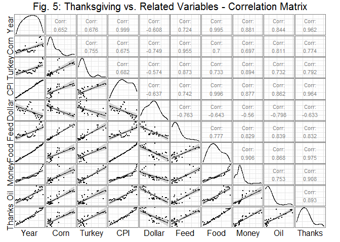 

To get a better sense of which independent variables are correlated with the change in Thanksgiving Dinner costs we can look at the correlations in year over year price changes. This will tell us whether or not any of these other variables show similar price movements from year to year. For example, does the annual rate of change in Thanksgiving Dinner costs correspond to the annual rate of change in CPI, food prices, oil, or the money supply. Consider a matrix of these correlations in Fig. 6. As you can see, these correlations are much weaker when we consider rates of change instead of nominal values. The strongest correlation is between Thanksgiving costs and the prices of corn and turkey feed. This makes sense given that these factors are direct and primary inputs in the production costs for turkeys. Even corn and turkey feed appear to be fairly weak determinants to rely on for predictions though.

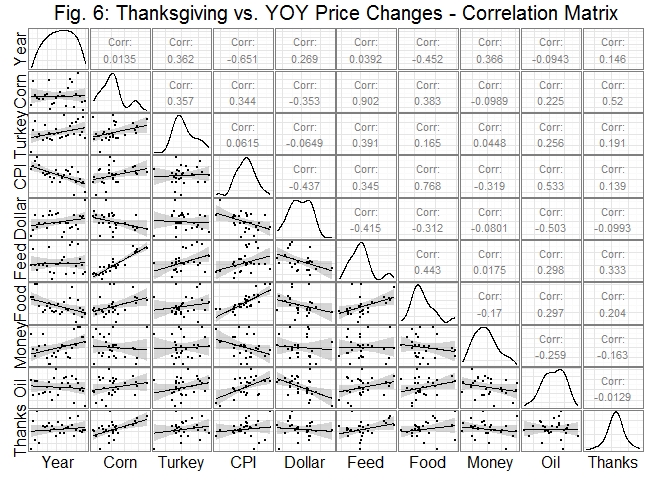 

An even greater challenge is that these rates of change are measures of the coincident impact on Thanksgiving Dinner costs, but to really leverage independent variables for prediction we either need leading indicators or a good way to reliably forecast the independent variables. To this end I considered the same correlations with the predictor variable lagged a year behind Thanksgiving Dinner prices. This gives me the correlations that will indicate whether using this year's values for the predictor variables can be used to predict next year's Thanksgiving prices. These lagged correlations are shown in Fig. 7. As the correlation matrix illustrates, there is virtually no correlations when using the lagged variables. This means we are not able to leverage any leading indicators from this data set. 

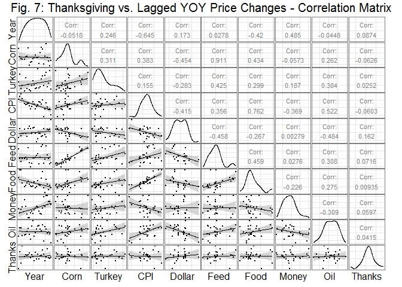 

If there is any hope of using predictor variables to forecast the future of Thanksgiving Dinner costs it looks like coincident corn prices might be the best bet. This means that I need to first forecast corn prices. I will cover building these models in the next section.

#### Build and Select Forecast Models

There are a few different options when forecasting future costs for Thanksgiving Dinner. These fall into roughly two categories. There is time series forecasting, in which the data from past observations of a particular data series are used to forecast the future of that same data series. The other broad category to consider are forecasting methods that utilize independent predictor variables to forecast the data series in question. The power of these different methods depends on the data and assumptions about the patterns and causal factors that can be exploited as forward indicators. For time series methods to work there must be patterns in the past, trends, seasonal fluctuations, and/or some sort of cyclical regularity in the historical data that can then be extrapolated based on the assumption that these patterns will continue into the future. In order to utilize predictor variables for forecasting there must either be independent leading indicators or independent coincident indicators which themselves exhibit reliable predictability.

Time series methods include moving averages, trend and season decomposition, exponential smoothing, and autoregressive integrated moving averages (ARIMA). In terms of forecasting the price of Thanksgiving Dinner directly with time series, the data is annual so there are no seasonal patterns to exploit. Additionally, there are no obvious and regular cyclical patterns in the Thanksgiving cost data. Time series methods in this context are more about tracing trends or assuming averages in order to extrapolate the future of annual Thanksgiving Dinner prices, although there are some more sophisticated techniques which we will consider. 

Methods that use independent variables to predict Thanksgiving prices could include regression analysis and machine learning techniques. These approaches can get quite complicated and as mentioned before the big challenge is that predictor variables must be leading indicators or coincident indicators which must be forecasted as well. I will consider some potential predictor variables, looking at how well these correlate to Thanksgiving Dinner costs and whether they are leading indicators or are themselves forecastable using time series techniques. 

First I want to make an attempt at forecasting the producer price for corn. Surely there are some sophisticated forecasting models being utilized for the prediction of corn yields and prices, but for my purposes this could get a little deep. To keep this analysis simple I will consider using two time series methods, Exponential Smoothing and ARIMA, to forecast the monthly prices for a five year period. Forecasting monthly prices will allow me to apply models with seasonal elements. Fig. 8 is a chart of the additive decomposed corn prices, the top panel shows the actual monthly price, the second panel shows the decomposed trend, the third panel shows the decomposed seasonal swings, and the bottom panel shows the decomposed error term. A quick inspection of this chart indicates that after many years of fairly stable prices, the trend has spiked up a couple of times in the recent past, in 2008 and again in 2010, but has headed back down most recently. This suggests we may have some challenges using time series methods to predict corn prices, since these cyclical ups and downs cannot be captured by the models.

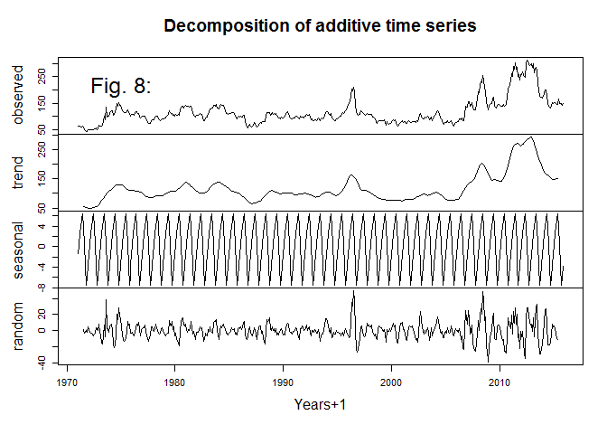 

In Fig. 9 I illustrate an Exponential Smoothing model forecast. This particular model, ETS(M, M, M) uses multiplicative assumptions for the error, trend, and seasonal components to build a model and forecast. The model is built from the data series through 2010, and the five year forecast generated is evaluated against the actual numbers for 2011 through 2015. The results are not great, with high error rates on the test set. I give it one more try using an ARIMA model, which is depicted in Fig. 10. The ARIMA(0, 1, 1)(0, 1, 1)12 is a seasonal "airport model" used by Box-Jenkins to demonstrate their methodology for doing ARIMA forecasts. For more on ARIMA see my previous article, "<a href="http://en.paperblog.com/what-i-learned-in-turkey-about-forecasting-turkey-dinner-730163/" target="_blank">What I Learned in Turkey about Forecasting Turkey Dinner</a>." While there is slightly better performance with the ARIMA model over the Exponential Smoothing model, the error rates are still very high.

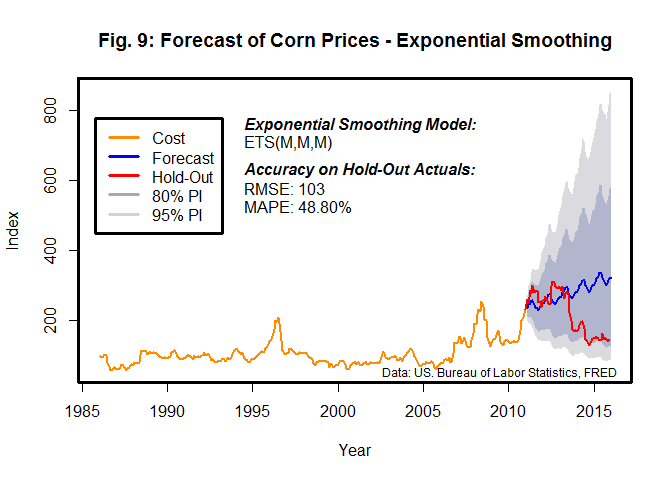 

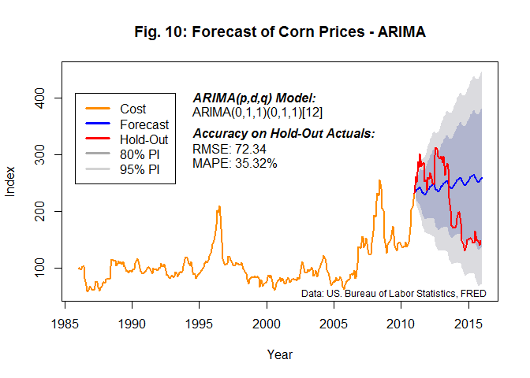 

Given the difficulty with forecasting the producer price of corn using time series methods, not to mention the mediocre correlation as a predictor variable for Thanksgiving Dinner costs, the approach of using predictor variables and regression does not appear promising. Perhaps in the future I could turn my sights onto forecasting corn and other related variables more accurately. For now I will abandon the use of drivers and causal factors, and simply forecast Thanksgiving Dinner costs using time series methods. 

I will train and build four time series models using Thanksgiving Dinner prices from 1986 to 2010 and then test the predictions from these models against the actual prices from 2011 to 2015. The purpose of this approach of splitting the data into training and testing sets is to reduce the problem of overfitting and to compare the quality of different methods. Overfitting can be a problem for predictive models when the model is trained to precisely fit the data without considering how well this model will perform on new independent data, because the precise fit may include idiosyncratic factors that are not present in other samples of the data. Comparing the forecasts to an independent testing set gives us an estimate of the out of sample error rates and gives us a truer sense of which methods might perform better on future data.

For the first time series forecast of Thanksgiving Dinner costs, I am using the Exponential Smoothing method. The model applied to this data is ETS(A, A, N), which means that it uses additive error, additive trend, and no seasonal component. This forecast is displayed in Fig. 11. In testing against the hold out sample, the model has an RMSE of 3.64 and a MAPE of 7.19%. This isn't excellent, but this outcome is much better than the 38% MAPE we saw when applying the Exponential Smoothing model to corn prices.

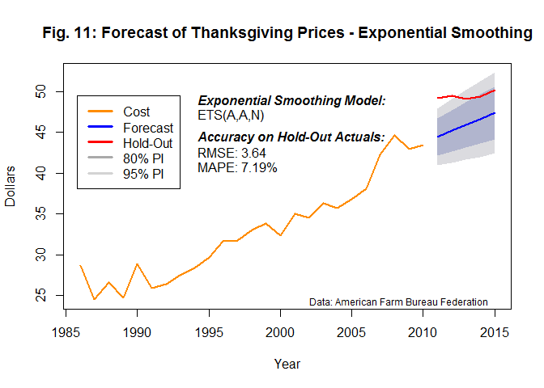 

Next I will use the non-seasonal ARIMA method with the specific model being ARIMA(3, 2, 4). To build this type of model one needs to specify the order of the autoregressive (AR), integrated (I), and moving average (MA) components, which the respective numbers in the paranthesis of the model. The autoregressive term specifies the relationship between any one time period and previous periods. The integrated term handles trends in the data and specifies how many times the data should be differenced in the model. The moving average term specifies the relationship between new forecasts and prior forecasts. This ARIMA model is the best performing time series option on the hold out sample data, with an RMSE of 1.89 and a MAPE of 2.72%. Most of the hold-out sample actuals fall within the prediction intervals, except the first observation.

How did I choose the order of the model components? This is a much more in depth model building process that what I have shown here. I actually built a specialized Shiny web app that handles model selection process for implementing ARIMA on the Thanksgiving Dinner price data. The model selection process used is the Box-Jenkins methodology of identification, estimation, and diagnostic checking, steps that are iterated until the desired model is found. You can try this for yourself with the <a href="https://realizingfutures.shinyapps.io/ThanksgivingArimaApp/" target="_blank">Thanksgiving Dinner Cost Forecaster</a>.

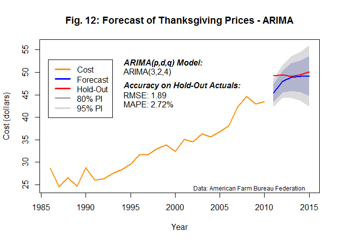 

For the third time series model I am just going to assume that future prices will increase at the annual mean inflation rate of Thanksgiving Dinner costs over the life of the entire time series. The mean inflation rate from 1986 to 2010 is 1.96% per year. With a RMSE of 3.51 and MAPE of 6.79% this method performs better on the hold-out sample than the Exponential Smoothing model, but not at well as the ARIMA model. One benefit is that the actuals in the hold-out period are all within the prediction intervals, but I should note that these intervals are fairly wide for this model.

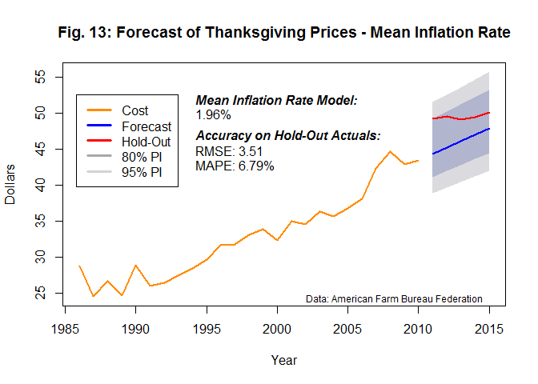 

The final model that I am utilizing is a simple linear regression. This method models the cost of Thanksgiving Dinner as a linear relationship to the year and fits the best line. This line takes the form y = -1520.94 + 0.78x, which suggests that for each year that passes the price of Thanksgiving Dinner will rise about 78 cents. Overall this is the second best performing model with a RMSE of 1.84 and MAPE of 4.49%, although two observations from the hold-out sample actuals falls outside the 95% prediction intervals and all of the hold-out sample actuals fall outside the 80% prediction intervals. 

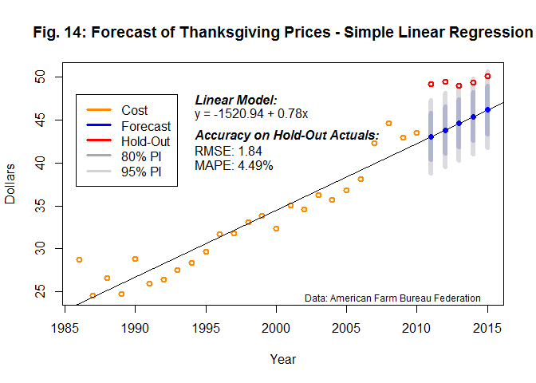 

#### Final Forecast

Now that I have tested a few models against hold-out sample data, I have decided to use all four models and average the output for a final forecast model. To do this I will use the four model approaches above, Exponential Smoothing, ARIMA, Mean Inflation Rate, and Simple Linear Regression, but I will reapply these models to the full time series for Thanksgiving Dinner. This means I will build the models using the data from 1986 through 2015 and then forecast the next five years out, 2016 through 2020. The final forecast will be the mean of the four individual forecasts, and the 80% and 95% prediction intervals will also be the means of the outcomes from the four forecast models. See Fig. 14 for a visual display of this final forecast. The reason I decided to take a simple mean of the four forecast models, rather than a weighted average, is because the past performance of these methods/models does not necessarily tell me which ones will be better or worse performers in the future. Given this a simple average provides a diverse selection. I have written more about the benefits of combining diverse forecasts in the article, "<a href="http://en.paperblog.com/macroeconomic-forecasting-with-diverse-predictions-501592/" target="_blank">Macroeconomic Forecasting with Diverse Predictions</a>." 

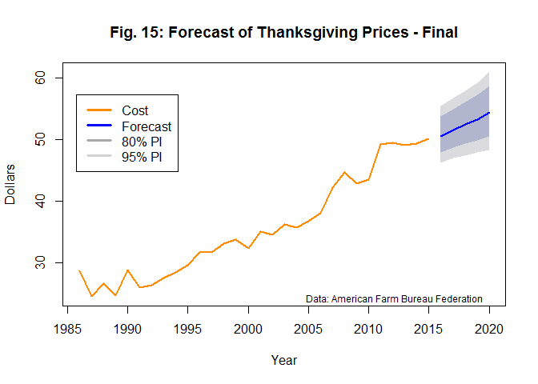 <!-- html table generated in R 3.2.0 by xtable 1.8-0 package -->
<!-- Sat Jan 23 22:06:15 2016 -->
<table border=1>
<tr> <th> Year </th> <th> Point_Forecast </th> <th> Low_80 </th> <th> High_80 </th> <th> Low_95 </th> <th> High_95 </th>  </tr>
  <tr> <td> 2016 </td> <td align="right"> 50.57 </td> <td align="right"> 47.89 </td> <td align="right"> 53.79 </td> <td align="right"> 46.27 </td> <td align="right"> 55.41 </td> </tr>
  <tr> <td> 2017 </td> <td align="right"> 51.57 </td> <td align="right"> 48.71 </td> <td align="right"> 54.99 </td> <td align="right"> 46.99 </td> <td align="right"> 56.72 </td> </tr>
  <tr> <td> 2018 </td> <td align="right"> 52.42 </td> <td align="right"> 49.32 </td> <td align="right"> 56.09 </td> <td align="right"> 47.46 </td> <td align="right"> 57.95 </td> </tr>
  <tr> <td> 2019 </td> <td align="right"> 53.28 </td> <td align="right"> 49.91 </td> <td align="right"> 57.23 </td> <td align="right"> 47.91 </td> <td align="right"> 59.24 </td> </tr>
  <tr> <td> 2020 </td> <td align="right"> 54.36 </td> <td align="right"> 50.57 </td> <td align="right"> 58.74 </td> <td align="right"> 48.35 </td> <td align="right"> 60.97 </td> </tr>
   </table>

  

My forecast for the cost of Thanksgiving Dinner in 2016 is $50.57, which is 46 cents higher than 2015 and represents a modest increase of 0.9%. There is an 80% probability that the cost will be between $47.89 and $53.79 and a 95% probability that it will be between $46.27 and $55.41. For my past forecasts of Thanksgiving Dinner costs I only predicted the cost one year ahead, but this time I have predicted the cost out five years. So looking out all the way to 2020 I am forecasting a 8.5% increase and $54.36 for Thanksgiving Dinner. This far out there is a lot of uncertainty though and my prediction intervals grow to account for this. That wraps up my attemt at forecasting Thanksgiving Dinner costs for 2016 and beyond. 

  

#### Works Cited

Mishkin, Frederic S.. [*The Economics of Money, Banking, and Financial Markets*](http://www.amazon.com/gp/product/0321287266?ie=UTF8&tag=realizresona-20&linkCode=as2&camp=1789&creative=9325&creativeASIN=0321287266). Eighth Edition. Boston: Pearson Addison Wesley, 2007. Print. 

Mulvany, Lydia, Lin Linley and Megan Durisin. ["Thanksgiving Turkeys Cost More Than Ever After Bird Flu Wipeout"](http://www.bloomberg.com/news/articles/2015-11-12/thanksgiving-turkeys-cost-more-than-ever-after-bird-flu-wipeout). *Bloomberg.com*. 12 Nov. 2015. Web. 10 Dec. 2015.

Sullivan, Paul. ["In the Labyrinth of Turkey Pricing, a Reason Under Every Giblet"](http://www.nytimes.com/2011/11/19/your-money/a-primer-to-calculate-turkey-prices.html). *NYTimes.com*, 2011 Nov. 18. Web. 10 Dec. 2015.

["Thanksgiving Dinner Up a Tad, to Just Over $50"](http://www.fb.org/newsroom/news_article/369/). *American Farm Bureau Federation (AFBF)*. Contacts: Kari Barbic and Cyndie Shearing. 19 Nov. 2015. Web. 10 Dec. 2015.

Westhoff, Patrick. [*The Economics of Food: How Feeding and Fueling the Planet Affects Good Prices*](http://www.amazon.com/gp/product/0137006101?ie=UTF8&tag=realizresona-20&linkCode=as2&camp=1789&creative=9325&creativeASIN=0137006101). Upper Saddle River, NJ: Pearson Education, Inc., 2010. Print.

["Where Do Turkeys Come From? Let's Find Out Using Power BI"](http://blogs.msdn.com/b/powerbi/archive/2013/11/27/where-do-turkeys-come-from-let-s-find-out-using-power-bi.aspx). *Microsoft Power BI, MSDN*.  27 Nov. 2013. Web. 10 Dec. 2015.

